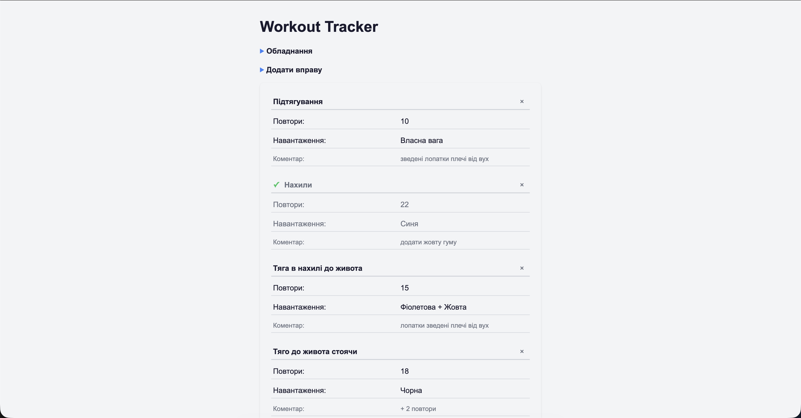

# Workout Tracker

A workout tracker for resistance band and weighted vest training. Built with vanilla JavaScript — my second independent project while learning front-end development.

**[Live Demo](https://webdeveloper-olehrozhanskyi.github.io/Workout-Tracker/)**



## Features

- Add exercises with reps, load and personal notes
- Mark exercises as done (click to toggle)
- Delete exercises
- Progress counter (done / total)
- Data persists between sessions via localStorage
- Collapsible equipment reference table
- Empty state message

## Tech Stack

- Vanilla JavaScript (ES modules)
- Web Storage API (localStorage)
- Vite 7
- SCSS + BEM methodology
- GitHub Actions (automated deployment to GitHub Pages)

## Getting Started

```bash
npm install
npm run dev
```

## Build

```bash
npm run build
```
