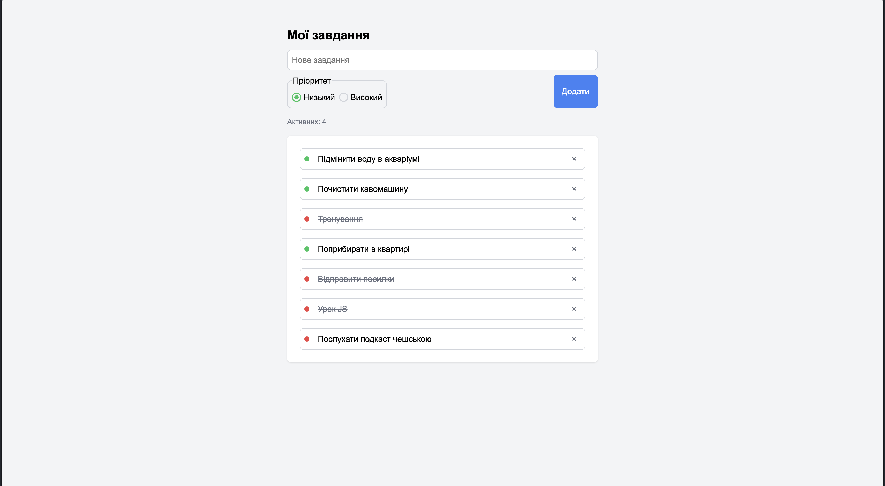

# ToDo List

A simple task manager built with vanilla JavaScript. My first independent project while learning front-end development.

**[Live Demo](https://webdeveloper-olehrozhanskyi.github.io/ToDoList/)**



## Features

- Add tasks with priority selection (low / high)
- Mark tasks as done (click to toggle)
- Delete tasks
- Active tasks counter
- Empty state message

## Tech Stack

- Vanilla JavaScript (ES modules)
- Vite 7
- SCSS + BEM methodology
- GitHub Actions (automated deployment to GitHub Pages)

## Getting Started

```bash
npm install
npm run dev
```

## Build

```bash
npm run build
```
